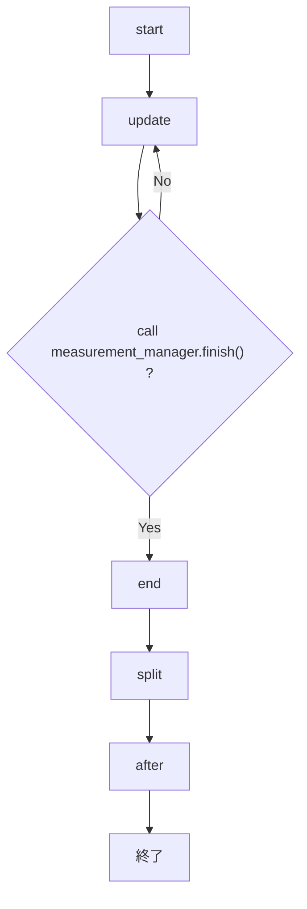

# SSR

【注意】ここに書いてあることと実際の実装が違う可能性があります。違うところを見つけたら修正しておいてください。

## セットアップ

[セットアップ方法](./setup/SETUP.md)を見てください。

## 定義ファイルの構成

- `DATADIR="任意のパス"`: データ保存先のパス（絶対パスor相対パス）必須
- `TEMPDIR="任意のパス"`: 一時データ保存先のパス（絶対パスor相対パス）必須
- `MACRODIR="任意のパス"`: 測定マクロのあるフォルダーのパス（絶対パスor相対パス）任意
  - これを設定しておくと測定マクロ選択画面でここのパスから始まる

## SSR側のフォルダー情報

- scripts: SSRを動かしているスクリプトが入っている。
- shared_settings: 共有設定フォルダー。キャリブレーションファイルなど共有して扱うものを入れる。
  - calibration_file: ここにキャリブレーションファイルを入れる。
- temp: エラーログや直前に使った定義ファイル名などが保存されている。無くても困らないものをいれる。
  - LOG.txt: ログ。月ごとにログファイルが作成される(多分)。すべてのログが残るわけではなく､ `logger`で書き出したものが残る。
- Example: 使い方の例としていくつかの測定マクロがある。

*****

## 用語定義

- 測定マクロ: 実際に測定する処理を書いたpythonファイル。拡張子は`.py`か`.ssr`

## 仕様

測定マクロを書くときに注意すること

- インデントはスペース4つ分
  - これはPythonの仕様
  - 関数やfor文など":"がつく行の次の行は､前の行よりもスペース4つ分インデントを下げる
  - 関数やfor文などの範囲を抜けたらインデントを上げる
  - タブは使わない（使うとエラーが出る）(visualstudioの拡張機能などを使えばtabでスペース4つを入力できる)
- update()の関数は絶対に定義すること
- 関数外の変数（グローバル変数）に代入するときはglobal修飾子をつけて宣言する(Pythonの仕様)
- それなりに性能の良いPCを持っているならメモ帳以外のエディター（VS Codeなど）で書くことをオススメします

## 基本仕様

- `start()`、`end()`、`on_command(command)`、`split(filepath)`、`after(filepath)`の関数は定義しなくても良いが、逆にスペルミスなどがあってもエラーを吐かない（ログはでる）
- `split(filepath)`を定義した場合には測定データはフォルダーに入り、定義しなければ`DATAPATH`直下に測定データが置かれる
- `measurement_manager`のいくつかの関数は特定の関数内（`start`,`update`など）でしか使えません。詳しくは下の方を見るか、もしくはコードを直接見てください
- 入力したファイル名はクリップボードにコピーされる
  - コピーしたくないときはimport時に`mm._copy_prefilename=hoge`とでもしておけばよい（hogeは適当に定義した関数）
- `SSR_split`で`split`関数を呼び出した場合に`GPIB.get_instrument`は引数にかかわらず`None`を返すので注意（GPIBケーブルがつながって無くても動くようにするため）
- 関数外でprintの処理を書くと2回実行される
  - print以外の処理も実は2回ずつ実行されている
  - これはmultiprocessingによって2つのプロセスが走っていることが原因（そのかわりそれぞれの処理は独立しているのでたいていの場合影響はない）
  - 関数外にprint("あああ")などと書くと確認できる
  - 直せる人いたら誰か直しておいてください

## 測定の流れ


  
※`on_command`関数はコマンドを打ち込んでEnterを押したときに実行されます。`on_command`が実行している間`update`は止まります。（詳しくはmeasurement_manager.pyの中身を見てください）
  
※`measurement_manager.finish()`を呼ぶか、updateでFalseを返さなければ測定は終了しません

### 測定と分割の独立

分割の関数はend()の後に改めて呼ばれます｡ 分割に失敗したときなど､分割の処理だけを呼ぶことができます。

*****

## `measurement_manager.py (=mm)`について

measurement_manager.pyは測定に必要な主な処理のうち､ ユーザー側からよく呼ばれるであろう処理をまとめたモジュールです。

```python
mm.plot(x, y, label="default")
# データプロットの関数、update以外の場所から呼ばないでください（startでもいけるかも）
# x,y (float): プロットする座標
# label (str or int): ラベル、ラベルごとに色が変わったり線が引かれたりする

mm.save(data)
# データ保存、update以外の場所から呼ばないでください（endでもいけるかも）
# data (tuple or string): 保存するデータ

mm.set_plot_info(line=False, xlog=False, ylog=False, renew_interval=1, legend=False, flowwidth=0)
# プロットの設定、startで呼ぶ
# line (bool): 点を線でつなぐかどうか                  
# xlog,ylog (bool): logスケールにするかどうか
# renew_interva (float): グラフの更新間隔（秒）
# legend (bool): 凡例をつけるか(plot_data)
# flowwidth (float): グラフの横幅を一定にして流れていくようなグラフにするときはこれに正の値を設定

mm.set_label(label)
# ファイルの冒頭につけるラベルの設定、これが呼ばれないときはラベル無しになる、start以外の場所から呼ばないでください
# label (str): ラベルの文字

mm.write_file(text)
#ファイルに任意の文字列を書き込み
#元々はset_labelしかなかったがあとからこれを追加
#set_labelでできることはこれでもできる(はず)
#text (str): 書き込む文字列

mm.finish()
# 測定を終わらせる関数、startで呼ぶとエラーになる（はず）

mm.no_plot()
#プロット画面を出さないときに呼ぶ

```

*****

## split.py(=split)について
```python

split.file_open(filepath)
# ファイルを開いてデータを配列で返す
# filepath (str): 開くファイルのパス
# return
#   data (list(list(float))): ファイルの中身のうち数字の配列に変換できたもの
#   filename (str): filepathのファイルの名前
#   dirpath (str): filapathの親フォルダ
#   label (str): ファイルの中身のうち数字でないもの  

split.heating_cooling_split(data, T_index, sample_num=150, threshold=0.7)
# 昇温/降温で分割
# data (list[list]): データ
# T_index: 温度データの場所（0始まり）
# sample_num (int): 温度変化を評価するサンプル数
# threshold (float): 温度変化を評価する閾値
# return (list[list]): 1つ1つの要素が分割されたデータ配列になっている

split.cyclic_split(data, cycle_num)返値:
# 周期的に分割
# data (list[list]): データ
# cycle_num: 分割の周期
# return (list[list]): 1つ1つの要素が分割されたデータ配列になっている

split.create_file(filepath, data, label):        
# 新規ファイル作成
# filepath (str): 新しく作成するファイルのパス
# data (list[list]): ファイルに書き込むデータ
# label (str): ファイル先頭につけるラベル

split.from_num_to_10Exx(num, significant_digits=2):      
# 数値→文字変換（例 10000 → 10E4.0）
# num (int | float): 変換する数字
# significant_digits (int): 有効数字
# return (str): 変換した文字列

split.TMR_split(filepath, T_index, f_index, freq_num=16, threshold=0)
# TMR用の分割関数
# filepath (str): 分割するファイルのパス
# T_index (int): 温度が入っている場所（0始まり）
# f_index (int): 周波数が入っている場所（0始まり）
# freq_num (int): 測定周波数の数
# threshold (float): 温度変化の閾値、うまく分割できないときなどに設定してください  
```

*****

## calibration.pyについて
主にTMRの抵抗-温度変換の線形補間を行う

```python
TMRCalibrationManager : class
#キャリブレーションを任せるクラス
#これのインスタンスを呼び出して使う

  TMRCalibrationManager.set_shared_calib_file()
  # キャリブレーションファイルを共有フォルダから取得してインスタンスにセット
  # キャリブレーションファイルを変更するときは形式を以前のファイルとそろえてください

  TMRCalibrationManager.set_own_calib_file()
  # 自分で指定したキャリブレーションファイルをインスタンスにセット
  # 特別な事情がある場合のみ使用してください

  TMRCalibrationManager.calibration(x: float)
  # プラチナ温度計の抵抗値xに対応する温度yを線形補間で返す

```

*****

## GPIB.pyについて
GPIBケーブルで繋がった機器にコマンドを送信する

```python

get_instrument(adress) :inst
# 機器の取得
# adress:int or str 機器のGPIB番号
# inst型のインスタンスを返す(型が不明なので便宜上inst型と命名)

inst.query(command):str
# 返り値のあるコマンドを送信して、返り値を受け取る
# command: str コマンド

inst.write(command):Unit
# 機器にコマンドを送信する
# command: str コマンド

inst.read() :str
# 機器からの応答を受け取る
# inst.write(comannd) → inst.read() は inst.queryと(ほぼ)同じ


```

*****

## variables.pyについて
共有変数を格納しておくところ
set_xxxで変数の格納、
xxxで呼び出し

```python


variables.USER_VARIABLES :class
# 各ユーザーがそれぞれ個別に持つ変数を持つクラス

  variables.USER_VARIABLES.TEMPDIR : Path
  #ユーザー一時フォルダのパス
  variables.USER_VARIABLES.set_TEMPDIR(value: Path) 
  #変数格納(以下では省略)

  variables.USER_VARIABLES.TEMPDIR : Path
  #データ保存フォルダのパス

  variables.USER_VARIABLES.TEMPDIR : Path
  #測定マクロのフォルダのパス


variables.SHARED_VARIABLES : class
# ユーザー間で共通してもつ変数

  variables.SHARED_VARIABLES.SETTINGDIR
  # 共有設定が保存されるフォルダのパス

  variables.SHARED_VARIABLES.TEMPDIR
  # 一時フォルダのパス

  variables.SHARED_VARIABLES.SSR_SCRIPTSDIR
  # SSRのコードがあるフォルダのパス
  # ユーザー側から触ることはまずない

  variables.SHARED_VARIABLES.SSR_HOMEDIR
  # SSR本体の存在するフォルダのパス
  # ユーザー側から触ることはまずない

  variables.SHARED_VARIABLES.LOGDIR
  # 共有ログのあるフォルダのパス


```

*****

## FAQ

### SSR.exeの中身は何か?

とくに変更がなければstartup.batを実行しています。
startup.batはMAIN.pyを実行しています。

### プロットの色を変えたい

windowModuleのcolormapを外部から変更すればできる（たぶん）。元々のコードの書き換えは全員に影響が出るので基本的に行わないように。

### 実装を変えたい

pythonは外部からのアクセスが容易な言語なので､自分用に設定を変える場合などはコードを書き換える必要はなく､外部から関数や変数を自分のものに置き換えることができます。コード本体の書き換えを行う場合は､これまでの測定マクロとの互換性を壊す場合には他の使用者の確認をとってください

### エラーが出た

[エラーと解決法](./TROUBLE_SHOOTING.md)を見てみてください。
